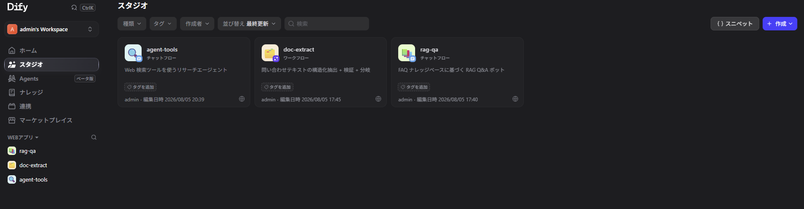

# dify-workflow

## 概要

Dify をセルフホストし、3 種類のワークフロー(RAG / 構造化抽出 / ツール利用エージェント)を構築した検証。
各ワークフローの DSL エクスポートは `docs/` にあり、Dify にインポートすればそのまま再現できる。

## 技術スタック

- Dify 1.16.1(セルフホスト / docker compose)
- Docker, Docker Compose v2
- OpenAI API(gpt-4o-mini / text-embedding-3-small)
- Open-Meteo API(カスタムツールの題材。API キー不要)

## 動かし方

```bash
# 1. Dify 本体を取得(このディレクトリ配下、git 管理外)
git clone https://github.com/langgenius/dify.git
cd dify
git checkout 1.16.1   # 検証時のバージョンに固定

# 2. 環境設定を作成して起動
cd docker
cp .env.example .env
# SECRET_KEY は空のままだと storage が書けない環境で api が起動しないため明示設定する
sed -i "s|^SECRET_KEY=.*|SECRET_KEY=$(openssl rand -base64 42 | tr -d '\n')|" .env
docker compose up -d

# 3. 初期セットアップ(管理者アカウント作成)
# ブラウザで http://localhost/install を開く
```

起動後 <http://localhost> にアクセスし、以下を行う。

1. 設定 → モデルプロバイダーで OpenAI プラグインをインストールし、API キーを登録
2. ナレッジで `src/sample-data/faq-taskflow.md` をアップロード(チャンク区切りを `###` にすると Q&A 単位で分割される)
3. スタジオ → アプリを作成 → DSL ファイルをインポートで `docs/*.dsl.yml` を取り込む
4. rag-qa はインポート後、知識取得ノードのナレッジを手順 2 で作ったものに差し替える

- ポート 80 が使用中の場合は `.env` の `EXPOSE_NGINX_PORT` を、443 が使用中の場合は `EXPOSE_NGINX_SSL_PORT` を変更する
- 停止は `docker compose down`、データは docker volume に永続化される

## 構築したワークフロー

| アプリ | モード | 構成 |
| --- | --- | --- |
| rag-qa | チャットフロー | 知識取得(FAQ ナレッジ)→ LLM → 回答。コンテキスト外質問は定型フォールバック |
| doc-extract | ワークフロー | LLM で問い合わせテキストを JSON 抽出 → コードノードで検証 → IF/ELSE で成功/失敗に分岐 |
| agent-tools | チャットフロー | エージェントノード(function calling)+ Open-Meteo カスタムツール 2 種。都市名→座標→天気の多段ツール連鎖 |

## 工夫した点・設計判断

- **構築を全て console API で実施**(ブラウザ操作なし)。draft 同期 → draft 実行 → publish → DSL export までを
  API で回し、プロンプト・グラフ定義を再現可能な形で管理した。
- **RAG のチャンク設計**: FAQ を `###`(質問見出し)区切りでチャンク化し、1 チャンク = 1 Q&A に。
  検索精度が上がり、ヒットテストで正解チャンクがスコア 0.68 でトップに来ることを確認。
- **ハルシネーション対策**: rag-qa はシステムプロンプトで「コンテキスト外は定型文で回答拒否」を強制し、
  FAQ にない質問(Slack 連携可否)で実際にフォールバックすることを確認。
- **LLM 出力の検証を LLM 任せにしない**: doc-extract は抽出結果をコードノード(Python)で
  スキーマ検証(必須キー・列挙値)し、失敗を IF/ELSE で別出力に分岐。バッチ処理での後段連携を想定した作り。
- **外部検索ツールの不安定さを回避**: DuckDuckGo(レート制限)・Wikipedia(ライブラリ UA ブロック)は
  データセンター環境で不安定と確認し、エージェントのツールは OpenAPI スキーマから登録した
  Open-Meteo カスタムツールに変更。LLM が壊しやすいパラメータ(`current` の項目名)は
  定数固定(auto=0)にして安定化した。

## 成果物



- `docs/studio.png` — 構築した 3 アプリ(スタジオ画面)
- `docs/rag-qa.dsl.yml` — RAG Q&A チャットフローの DSL
- `docs/doc-extract.dsl.yml` — 構造化抽出ワークフローの DSL
- `docs/agent-tools.dsl.yml` — 天気エージェントの DSL
- `docs/workflow-plan.md` — 設計メモ
- `src/sample-data/faq-taskflow.md` — RAG 用サンプル FAQ(架空プロダクト)
